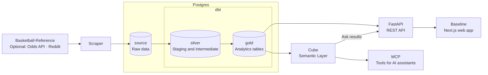

# Baseline

Baseline is a full stack NBA analytics platform, from data collection and a Postgres warehouse to predictive modeling, APIs, and a Next.js web app. Explore players, teams, standings, schedules, game flow, and player comparisons.

**Visit the app: [baseline.jyablonski.dev](https://baseline.jyablonski.dev)**

## Architecture

The main data flow collects NBA data, transforms it into analytics tables, and serves it to the web app and AI tools.

Postgres holds three schemas: `source` for ingested data, `silver` for cleaned intermediate models, and `gold` for analytics tables consumed by the API, Cube, and ML jobs. The web app talks to FastAPI; Ask and MCP use Cube to query the warehouse.

## Services

| Service             | Role                                                                                                                       |
| ------------------- | -------------------------------------------------------------------------------------------------------------------------- |
| `services/scraper`  | Collects NBA stats, schedules, play-by-play, contracts, and injuries, plus optional odds and Reddit data, into Postgres.   |
| `services/migrate`  | Uses Alembic to create and update the `source` database tables.                                                            |
| `services/dbt`      | Cleans and joins source data into `silver` models and `gold` analytics tables.                                             |
| `services/ml`       | Generates pregame win probabilities with Elo ratings and writes predictions back to `source` for dbt to publish to `gold`. |
| `services/api`      | Serves analytics through FastAPI REST endpoints and routes Ask questions through Cube.                                     |
| `services/frontend` | Provides the Baseline web app with Next.js, including browsing, charts, comparisons, and an Ask page.                      |
| `services/cube`     | Defines shared metrics and queryable datasets over `gold` for Ask and MCP.                                                 |
| `services/mcp`      | Exposes Cube queries as FastMCP tools for AI assistants.                                                                   |

## Documentation

See the [docs](docs/) for architecture, data pipelines, modeling, app features, brand resources, testing, and development and operations guides.
