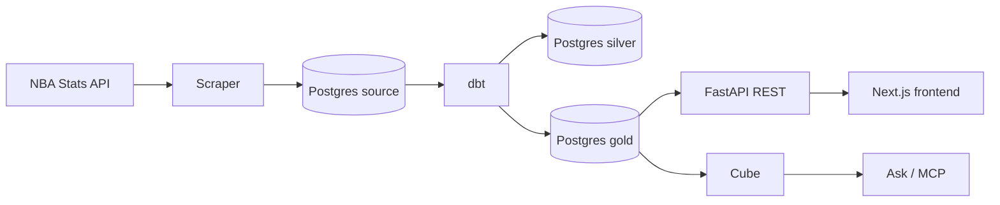

# NBA Analytics Platform

Scrape NBA Stats into Postgres, transform with dbt, serve via FastAPI / Cube (Ask + MCP) / Next.js.

## Architecture



## Services

- `services/scraper` — NBA Stats + BRef contracts/injuries + optional Odds API → `source` schema
- `services/migrate` — Alembic for `source` tables (`make db-migrate`)
- `services/dbt` — dbt: `source` → `silver` + `gold` marts
- `services/ml` — Elo pregame WP (one-shot; writes `source.game_predictions`)
- `services/api` — FastAPI REST over `gold`
- `services/frontend` — Next.js UI (port 3000)
- `services/mcp` — FastMCP tools over Cube
- `services/cube` — Cube semantic layer for Ask/MCP (started by `make up`; off in prod overlay)

## Quick start

```bash
cp .env.example .env
make up          # Tilt + Docker Compose (hot reload)
make down        # also removes the nba buildx / BuildKit builder
make scrape      # pipeline scrape (honors source.scrape_pipeline; FORCE=1 to bypass)
make dbt         # dbt deps + seed + run + test
make ml          # Elo score then gold copy
make refresh     # scrape then dbt then ml
```

Postgres schemas: `source` (scraper + pipeline gate), `silver` (dbt staging), `gold` (dbt marts). Empty schemas from `db/init.sql`; Alembic fills `source`. Wipe old volumes: `docker compose down -v`. Local Cube is `:4000` (Ask/MCP). Production overlay does not start Cube.

Images build for **this machine's CPU** (`linux/amd64` or `linux/arm64`). There is no Compose `platform:` pin (that would emulate x86 on Apple Silicon).

```bash
make build              # native-arch runtime images (api, frontend, tools, cube)
make build-multiarch    # linux/amd64 + linux/arm64 via buildx (`docker-bake.hcl`)
```

`make build-multiarch PUSH=1 IMAGE_PREFIX=ghcr.io/org/` pushes a multi-arch manifest. Without `PUSH`, images stay in the buildx builder cache (classic Docker cannot load two platforms with `--load`). Official bases (postgres, python, node, uv, `cubejs/cube`) already publish amd64+arm64; Docker pulls the variant that matches the host. If a cross-arch `RUN` fails, register qemu and recreate the builder:

```bash
docker run --privileged --rm tonistiigi/binfmt --install amd64,arm64
docker buildx rm nba && make ensure-buildx-builder
```

## Docs

- [docs/data.md](docs/data.md)
- [docs/frontend.md](docs/frontend.md)
- [docs/mcp-and-ai.md](docs/mcp-and-ai.md)
- [AGENTS.md](AGENTS.md) — conventions for coding agents

## Tests

```bash
make test-api / test-scraper / test-mcp / test-ml   # unit only (no Docker; default pytest)
make test-api-integration                # Testcontainers Postgres (API)
make test-scraper-integration            # Testcontainers Postgres (scraper DB helpers)
make test-mcp-integration                # reserved; MCP unit tests mock Cube (no live Cube)
make test-integration                    # all three Python integration suites
make test-migrate                         # Alembic unit + upgrade on throwaway Postgres
make test-migrate-unit                    # Alembic unit only (no Testcontainers; what CI runs)
make quality                             # pre-commit run --all-files (npm ci if frontend prettier is missing)
make test-dbt                            # dbt e2e via docker-compose.e2e.yml (runs migrate first)
make test                                # unit suites + frontend + dbt (not Testcontainers)
```

Integration tests need a working Docker socket (`/var/run/docker.sock` or `DOCKER_HOST`). They apply `db/init.sql`, Alembic (`services/migrate`), and, for API/MCP, seed gold marts from `db/analytics_integration*.sql` (dbt remains covered by `make test-dbt`). Tests auto-skip if Docker is unavailable.

CI (`.github/workflows/ci.yml`) on pull requests and pushes to `main` runs `make quality` (repo pre-commit hooks), `make test-frontend`, and `make test-api` / `test-scraper` / `test-mcp` / `test-cube` / `test-ml` / `test-migrate-unit`. It does not run `make test-dbt`, Playwright, or Testcontainers.

## CI and production

`make up` is Tilt for local development only. Production hosting files are `Caddyfile` and `docker-compose.prod.yml` (runtime images + Caddy; Postgres/API/frontend unpublished). See [docs/plans/oci-caddy-hosting.md](docs/plans/oci-caddy-hosting.md). Go-live still needs an OCI VM, Cloudflare grey-cloud DNS for `baseline.jyablonski.dev`, and GitHub secrets (`OCI_HOST`, `OCI_USER`, `OCI_SSH_KEY`) plus repository variable `ENABLE_OCI_DEPLOY=true`.

On push to `main`, `.github/workflows/ci.yml` runs an `images` job that bakes `linux/arm64` runtime images on `ubuntu-24.04-arm` and pushes them to GHCR, then a `deploy` job that SSHs `make prod-deploy IMAGE_PREFIX=… IMAGE_TAG=<sha>`. The VM pulls; it never builds. Both jobs stay skipped unless `ENABLE_OCI_DEPLOY=true`, and neither runs on pull requests. Leaving `IMAGE_PREFIX` empty falls back to building on the box (`make prod-release`), which is how first bring-up works.
